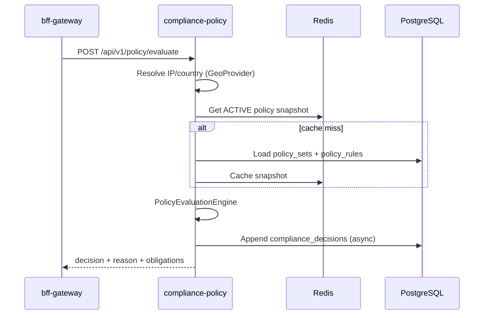

# Evaluation Flow

```mermaid
sequenceDiagram
    participant BFF as bff-gateway
    participant PDP as compliance-policy
    participant Redis as Redis
    participant PG as PostgreSQL

    BFF->>PDP: POST /api/v1/policy/evaluate
    PDP->>PDP: Resolve IP/country (GeoProvider)
    PDP->>Redis: Get ACTIVE policy snapshot
    alt cache miss
        PDP->>PG: Load policy_sets + policy_rules
        PDP->>Redis: Cache snapshot
    end
    PDP->>PDP: PolicyEvaluationEngine
    PDP->>PG: Append compliance_decisions (async)
    PDP-->>BFF: decision + reason + obligations
```

## 引擎步骤

1. 按 `RuleType` 优先级排序规则
2. 逐条评估，命中 DENY/REVIEW 立即返回
3. 收集 ALLOW 候选
4. 无拒绝时：显式 ALLOW 或隐式 ALLOW
5. 关键动作 + 无国家上下文 → FAIL_CLOSED
